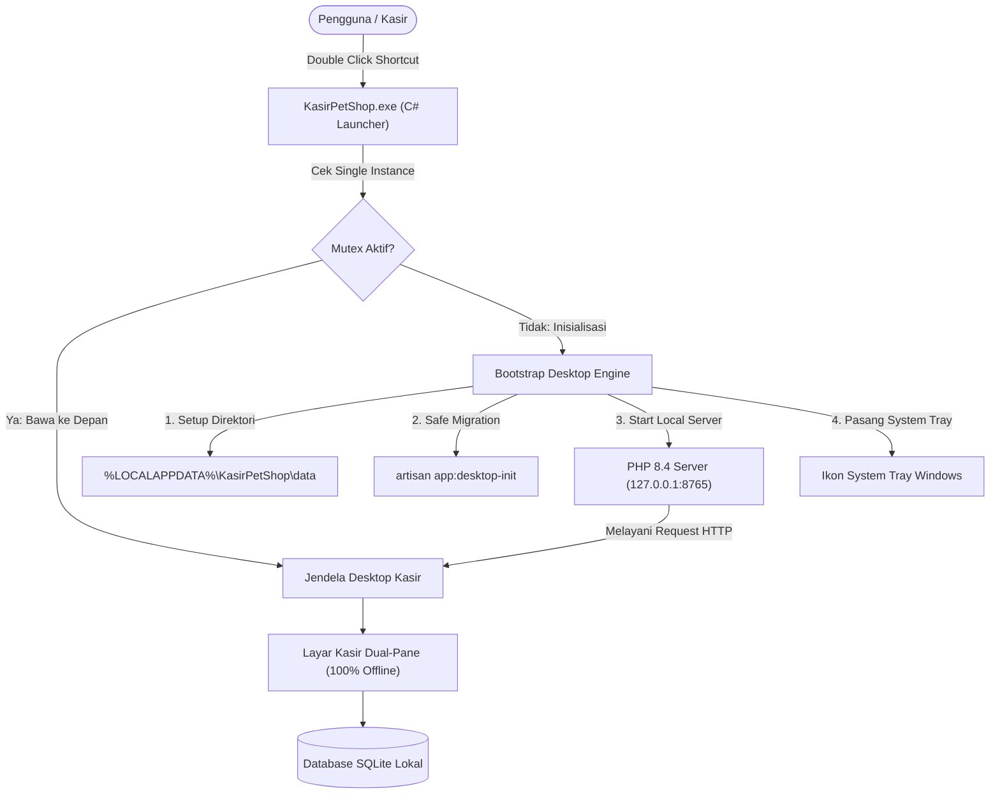
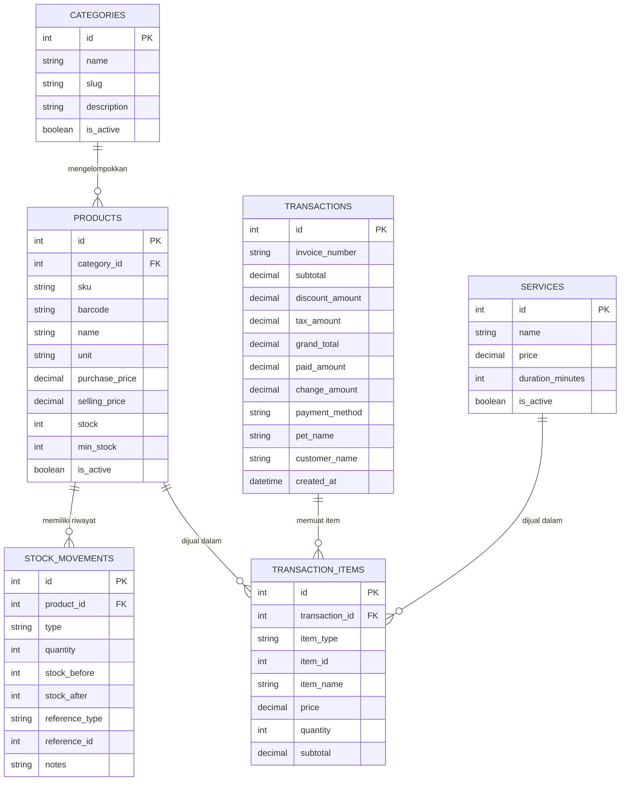

# 📖 Dokumentasi Teknis Sistem Kasir Pet Shop Desktop (Offline POS)

Dokumentasi komprehensif mengenai arsitektur teknis, alur proses bisnis, siklus hidup runtime desktop, skema database SQLite, dan mekanisme operasional sistem **Kasir Pet Shop Desktop**.

---

## 1. Arsitektur Sistem Desktop & Siklus Hidup Aplikasi

Aplikasi ini menggunakan pendekatan **Hybrid Native Desktop Shell** yang membungkus framework Laravel 13 dan runtime PHP 8.4 portabel menjadi satu kesatuan aplikasi Windows mandiri (*self-contained*):

### Komponen Arsitektur:
1. **Desktop Shell (`launcher/KasirPetShop.cs`)**:
   - Ditulis menggunakan C# .NET Framework 4.8.
   - Mencegah *multiple instances* menggunakan mutex bernama `KasirPetShopDesktopSingleInstanceMutex`.
   - Menghidupkan server PHP lokal di loopback `127.0.0.1:8765`.
   - Mengelola System Tray NotifyIcon yang memungkinkan kasir membuka kembali layar kasir, dashboard, katalog, atau menutup server dengan rapi saat keluar.
2. **Laravel 13 Application Core**:
   - Memproses logika transaksi kasir, perhitungan diskon & pajak, mutasi stok, serta laporan operasional.
3. **Data Storage & Isolasi Windows**:
   - Database aktif SQLite, backup berkala, dan log disimpan di `%LOCALAPPDATA%\KasirPetShop\data\database.sqlite`.
   - Hal ini memastikan ketika aplikasi di-update atau installer baru dijalankan, data transaksi pengguna tidak pernah terhapus.

---

## 2. Struktur Skema Database SQLite & Relasi Eloquent

Database menggunakan SQLite lokal dengan indeks performa tinggi pada kolom pencarian:

---

## 3. Logika Kasir & Aturan Perhitungan Transaksi

Perhitungan kasir dijalankan di sisi frontend untuk responsivitas instan (`pos-engine.js`) dan diverifikasi secara independen di sisi backend (`app/Services/PosService.php`):

1. **Subtotal**:
   $$\text{Subtotal} = \sum (\text{Harga Item} \times \text{Kuantitas})$$
2. **Diskon**:
   - Diskon Nominal: langsung mengurangi subtotal.
   - Diskon Persentase: $(\text{Subtotal} \times \text{Diskon}\%) / 100$.
   - $\text{Total Setelah Diskon} = \max(0, \text{Subtotal} - \text{Diskon})$.
3. **Pajak (PPN)**:
   - Jika opsi pajak aktif: $(\text{Total Setelah Diskon} \times \text{Tarif Pajak}\%) / 100$.
   - Jika nonaktif: Rp0.
4. **Grand Total**:
   $$\text{Grand Total} = \text{Total Setelah Diskon} + \text{Pajak}$$
5. **Kembalian**:
   $$\text{Kembalian} = \max(0, \text{Uang Diterima} - \text{Grand Total})$$

---

## 4. Mekanisme Mutasi Stok Atomik

Setiap kali transaksi penjualan diselesaikan:
1. Transaksi database dimulai (`DB::beginTransaction()`).
2. Setiap item bertipe `product` dikunci untuk update stok.
3. Kuantitas stok produk dikurangi.
4. Entri `stock_movements` baru dibuat dengan tipe `sale`, mencatat `stock_before` dan `stock_after`.
5. Jika transaksi dibatalkan (*Void/Cancel*), stok dikembalikan dengan pergerakan bertipe `reversal`.
6. Transaksi di-commit (`DB::commit()`).

---

## 5. Format Cetak Printer Thermal (58mm & 80mm)

Sistem cetak menggunakan native CSS `@media print`:
- **58mm**: Lebar kertas 48mm–58mm, font ukuran 10–11px, tata letak ringkas.
- **80mm**: Lebar kertas 72mm–80mm, font ukuran 12px, margin standar.
- **Auto-Hide UI**: Elemen navigasi, tombol, dan header aplikasi otomatis disembunyikan saat dialog cetak terbuka.

---

## 6. Pipeline Build Installer Standalone Windows

Proses pembuatan file `.exe` diatur oleh [`build-windows.ps1`](./build-windows.ps1):
1. **Generasi Ikon (`build/MakeIcon.cs`)**:
   Mengekstrak path kurva vektor dari `logo-klinik2.svg`, memusatkan gambar secara proporsional, dan menghasilkan `app.ico` berstandar Win32 DIB (16x16 s/d 128x128) serta 256x256 PNG.
2. **Kompilasi Launcher (`KasirPetShop.exe`)**:
   Kompilasi C# menggunakan .NET 4.8 `csc.exe` dengan opsi `/win32icon:build\app.ico`.
3. **Pementasan Direktori Portabel**:
   Menggabungkan biner PHP 8.4 portabel, ekstensi, vendor Composer production, dan source code Laravel.
4. **Kompresi Multi-Core**:
   Mengompresi direktori pementasan menjadi `app_package.zip` menggunakan 7-Zip.
5. **Kompilasi Setup Wizard (`installer/KasirPetShopSetup.cs`)**:
   Menggabungkan `app_package.zip` sebagai embedded resource ke dalam executable `PetShopPOS-Setup.exe` dan `KasirPetShop-Setup.exe`.
6. **Refresh Shell Icon**:
   Memanggil refresh icon cache Windows agar ikon baru langsung muncul di File Explorer.

---

**Yanuar Ardhika Rahmadhani Ubaidillah (@ardhikaxx)**  
*Lead Software Architect*
