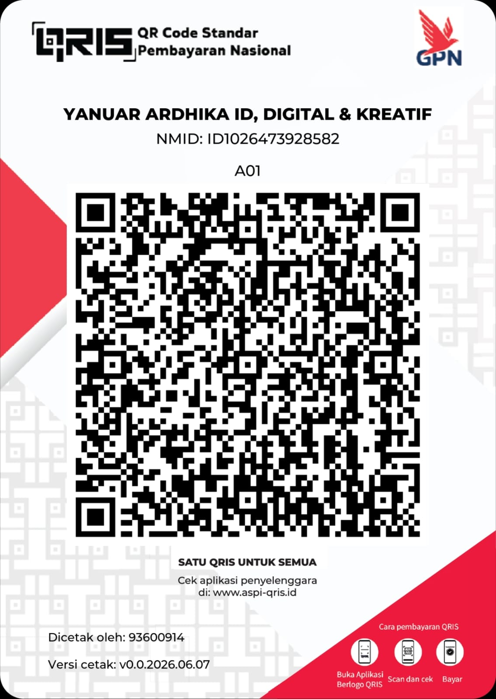

# 🐾 Kasir Pet Shop Desktop (Offline POS Windows)

[](https://laravel.com)
[](https://php.net)
[](https://sqlite.org)
[-0078D6?style=for-the-badge&logo=windows&logoColor=white)](https://microsoft.com)
[](LICENSE)

Aplikasi kasir desktop modern, mandiri (*self-contained*), dan lengkap untuk operasional harian toko hewan peliharaan (*Pet Shop* & Klinik Hewan). Dibangun menggunakan **Laravel 13**, **SQLite**, serta dibungkus dengan **Native Windows Launcher & Installer (C# .NET)**.

Dapat diinstal dan digunakan oleh siapa saja di Windows cukup dengan **1 file installer `.exe`**, tanpa perlu menginstal PHP, Composer, Node.js, XAMPP, maupun konfigurasi server secara manual.

---

## 🌟 Karakteristik Utama

- **100% Offline-First**: Tidak memerlukan koneksi internet untuk menjalankan seluruh fungsi kasir, inventaris, dan pelaporan.
- **Zero CDN & Zero Remote Assets**: Seluruh stylesheet, JavaScript, SVG icon, dan font berjalan 100% dari asset lokal.
- **Tanpa Login / Autentikasi**: Membuka aplikasi langsung menuju layar transaksi kasir (POS) atau Dashboard tanpa proses login yang memperlambat kasir.
- **Self-Contained Installer `.exe`**: Seluruh runtime PHP 8.4, ekstensi SQLite/PDO/GD/cURL, dependensi vendor production, dan native launcher sudah terkemas dalam satu file setup.
- **Isolasi Data Pengguna (`%LOCALAPPDATA%`)**: Database transaksi SQLite dan folder backup tersimpan di `%LOCALAPPDATA%\KasirPetShop`, sehingga data penjualan Anda tetap aman dan tidak akan hilang atau tertimpa saat aplikasi diperbarui.
- **Tema Desain Rose/Mauve Veterinary**: Mengadopsi palet warna hangat dan profesional khas klinik hewan (`#D88C9A` & `#B76E79`) dengan kontras tinggi yang nyaman di mata kasir.
- **Ikon & Logo Vektor Resmi**: Ikon aplikasi Windows multi-resolusi (16x16 hingga 256x256) di-render langsung dari siluet anjing & kucing `logo-klinik2.svg`.

---

## 🖥️ Modul & Fitur Lengkap

### 1. 🛒 Kasir POS (Point of Sale)
- **Dual-Pane Desktop Layout**: Sisi kiri untuk pencarian katalog dan navigasi kategori; sisi kanan untuk keranjang kasir real-time dan kalkulator pembayaran.
- **Dukungan Barcode Scanner USB**: Bekerja *plug-and-play* dengan scanner barcode fisik (keyboard emulation dengan auto-enter).
- **Pintasan Keyboard (Shortcuts)**:
  - `F2`: Fokus ke kolom input barcode / pencarian
  - `F4`: Buka jendela pembayaran (Modal Bayar)
  - `F8`: Kosongkan keranjang belanja
  - `Escape`: Tutup popup modal
- **Transaksi Campuran Produk & Layanan**: Dapat menggabungkan produk fisik (makanan, vitamin, pasir kucing) dan layanan jasa (grooming, mandi jamur, pet hotel) dalam satu nota.
- **Kalkulasi Otomatis**: Subtotal, diskon (nominal atau persentase), opsi pajak PPN (dapat diaktifkan/dinonaktifkan), dan kalkulator uang kembalian.
- **Tombol Uang Pas / Quick Cash**: Pilihan nominal cepat (Uang Pas, Rp20.000, Rp50.000, Rp100.000, +Rp10.000, dll).
- **Metode Pembayaran Fleksibel**: Tunai (*Cash*), QRIS Statis, dan Transfer Bank tanpa gateway eksternal.

### 2. 🧾 Struk Thermal & Struk Digital
- **Format Struk Kasir Thermal**: Dioptimalkan untuk kertas struk ukuran **58mm** dan **80mm**.
- **Mode Cetak Bersih (`@media print`)**: Hanya mencetak nota struk dan otomatis menyembunyikan navigasi aplikasi.
- **Salin Teks Nota (Digital)**: Satu klik untuk menyalin format struk ke clipboard (siap dikirimkan via WhatsApp Desktop).

### 3. 📦 Katalog Produk & Inventaris
- Informasi lengkap: SKU, Barcode, Nama Produk, Kategori, Satuan (pcs, kg, pouch, kaleng, pack), HPP (Harga Modal), Harga Jual, Stok Fisik, dan Batas Minimum Stok.
- **Integritas Riwayat Penjualan**: Menggunakan *soft deletes* dan *price snapshot*, sehingga perubahan harga atau penghapusan produk di masa depan tidak merusak histori transaksi masa lalu.
- **Filter Inventaris**: Semua Produk, Stok Tersedia, Stok Menipis, dan Stok Habis.

### 4. 📊 Kartu Mutasi Stok (Stock Movement)
- **Pencatatan Stok Atomik**: Pemotongan stok dijalankan secara aman di dalam `DB::transaction()`.
- **Riwayat Mutasi Transparan**:
  - `initial`: Stok awal produk
  - `in`: Penerimaan stok masuk (restock)
  - `sale`: Penjualan kasir
  - `adjustment`: Penyesuaian stok opname fisik
  - `reversal`: Pengembalian stok otomatis saat nota transaksi dibatalkan

### 5. ✂️ Modul Layanan Jasa Pet Shop
- Mengelola layanan perawatan hewan seperti: Mandi Sehat, Grooming Kutu/Jamur, Potong Kuku, Salon Bulu, dan Penitipan Hewan (*Pet Hotel*).
- Layanan jasa tidak memiliki stok fisik dan tidak mengurangi inventaris barang.

### 6. 📈 Dashboard & Laporan Penjualan
- **Dashboard Operasional**: Omset hari ini, estimasi laba kotor hari ini, jumlah transaksi, peringatan produk menipis, dan daftar transaksi terbaru.
- **Laporan Penjualan**: Filter rentang tanggal fleksibel (harian, mingguan, bulanan, atau kustom), rincian pajak, dan diskon.
- **Laporan Produk & Layanan Terlaris (*Best Sellers*)**: Mengetahui item yang paling diminati pelanggan.
- **Ringkasan Metode Bayar**: Rekapitulasi omset berdasarkan metode pembayaran.

### 7. 💾 Cadangan Data (Backup & Restore)
- **Backup 1-Klik**: Membuat arsip salinan database SQLite (`.sqlite`) bertanda waktu.
- **Ekspor CSV**: Ekspor transaksi dan katalog produk untuk pembukuan Excel.
- **Restore Aman**: Validasi header SQLite sebelum diterapkan, lengkap dengan pembuatan *backup pengaman otomatis*.

---

## 📦 Unduh Installer Windows

Untuk pengguna akhir (*end-user*), Anda cukup mengunduh file installer `.exe` berikut:

| File Installer | Keterangan |
| :--- | :--- |
| **`KasirPetShop-Setup.exe`** | **Rekomendasi Utama** - Installer Windows mandiri 50 MB dengan ikon visual segar |
| **`PetShopPOS-Setup.exe`** | Installer alternatif siap pakai |

### Langkah Instalasi:
1. Klik dua kali pada file **`KasirPetShop-Setup.exe`**.
2. Klik tombol **"Pasang Sekarang"** (lokasi default: `%LOCALAPPDATA%\Programs\KasirPetShop`).
3. Setelah selesai, shortcut **Kasir Pet Shop** akan otomatis muncul di **Desktop** dan **Start Menu**.
4. Buka aplikasi, dan sistem kasir langsung siap digunakan!

---

## 🛠️ Pengembangan & Build Mandiri (Developers)

Jika Anda ingin mengembangkan atau mengompilasi ulang installer dari source code:

### Kebutuhan Sistem:
- Windows 10 atau Windows 11 (64-bit)
- PHP 8.2+ (PHP 8.4 direkomendasikan dengan ekstensi `pdo_sqlite`, `sqlite3`, `mbstring`, `fileinfo`, `curl`, `gd`)
- Composer
- .NET Framework 4.8 (`csc.exe` bawaan Windows)
- 7-Zip (opsional, untuk kompresi multi-core cepat)

### Langkah Setup Development:
```bash
# 1. Clone repository
git clone https://github.com/ardhikaxx/kasir-petshop-dekstop.git
cd kasir-petshop-dekstop

# 2. Install dependensi PHP
composer install

# 3. Setup environment & database awal
cp .env.example .env
php artisan key:generate
php artisan app:desktop-init

# 4. Jalankan Automated Tests
php artisan test
```

### Build Installer Windows (.exe):
Cukup jalankan script build PowerShell otomatis berikut:
```powershell
powershell -ExecutionPolicy Bypass -NoProfile -File build-windows.ps1
```
Script ini akan:
1. Mem-parsing SVG `logo-klinik2.svg` dan membuat ikon Win32 DIB multi-resolusi (`build/app.ico`).
2. Mengompilasi `KasirPetShop.exe` (launcher C# native dengan system tray).
3. Mengompilasi `uninstall.exe` (uninstaller native).
4. Mengemas seluruh PHP runtime portabel dan aplikasi ke dalam arsip `app_package.zip`.
5. Mengompilasi `KasirPetShop-Setup.exe` (installer mandiri).

---

## 📂 Struktur Direktori Proyek

```
kasir-petshop-desktop/
├── app/
│   ├── Console/Commands/       # app:desktop-init & artisan commands
│   ├── Http/Controllers/       # POS, Produk, Stok, Transaksi, Laporan, dll
│   ├── Models/                 # Product, Category, Service, Transaction, dll
│   └── Services/               # POS, Inventaris, dan Report business logic
├── build/
│   ├── app.ico                 # Ikon Win32 DIB multi-resolusi
│   ├── MakeIcon.cs             # Generator C# SVG to Win32 ICO
│   └── logo-preview.png        # Pratinjau visual logo
├── database/
│   ├── migrations/             # Struktur skema tabel SQLite
│   └── database.sqlite         # Database SQLite lokal
├── installer/
│   ├── KasirPetShopSetup.cs    # Source code C# Windows Installer Wizard
│   └── KasirPetShopUninstall.cs# Source code C# Windows Uninstaller
├── launcher/
│   └── KasirPetShop.cs         # Source code C# Native Desktop Launcher & Tray
├── public/
│   ├── css/petshop-ui.css      # Design system lokal (Rose/Mauve Veterinary Theme)
│   ├── js/pos-engine.js        # Logika kasir, kalkulator, & barcode scanner
│   └── images/logo.svg         # Asset vektor logo lokal
├── resources/views/            # Template Blade UI (100% offline)
├── build-windows.ps1           # Pipeline build installer otomatis
└── routes/web.php              # Rute navigasi POS Desktop
```

---

## 📚 Dokumentasi Sistem

* [📖 **DOKUMENTASI.md**](./DOKUMENTASI.md) — Struktur teknis, relasi database SQLite, arsitektur desktop, dan alur bisnis POS.
* [⚖️ **LICENSE**](./LICENSE) — Lisensi resmi [MIT License](./LICENSE).
* [🛡️ **SECURITY.md**](./SECURITY.md) — Kebijakan keamanan data lokal & pelaporan celah (*Responsible Disclosure*).
* [🤝 **CONTRIBUTING.md**](./CONTRIBUTING.md) — Pedoman kontribusi kode, standar PSR-12 Pint, dan workflow Git.
* [📜 **CODE_OF_CONDUCT.md**](./CODE_OF_CONDUCT.md) — Pedoman perilaku komunitas pengembang.
* [💬 **SUPPORT.md**](./SUPPORT.md) — Kanal bantuan teknis, troubleshooting, dan kontak resmi pengembang.
* [📋 **CHANGELOG.md**](./CHANGELOG.md) — Riwayat rilis fitur terstruktur (*Keep a Changelog* & SemVer).
* [📚 **CITATION.md**](./CITATION.md) — Format sitasi karya untuk keperluan penelitian dan akademik.

---

## 💖 Dukungan & Donasi

Jika proyek **Kasir Pet Shop Desktop** ini bermanfaat bagi Anda dan telah menghemat banyak waktu operasional toko Anda, Anda dapat menunjukkan apresiasi dengan memberikan traktiran kopi (donasi) melalui pemindaian kode QRIS di bawah ini:

<p align="center">
  
</p>

> Donasi sepenuhnya bersifat sukarela dan tidak mengikat. Aplikasi tetap dapat digunakan secara utuh tanpa donasi.

---

## 👨‍💻 Pengembang & Hak Cipta

Dirancang dan dikembangkan dengan penuh dedikasi oleh:  
**[Yanuar Ardhika Rahmadhani Ubaidillah (@ardhikaxx)](https://github.com/ardhikaxx)**  
*Lead Software Architect & Maintainer*

> **Copyright (c) 2024 - 2026 Yanuar Ardhika Rahmadhani Ubaidillah (@ardhikaxx). All Rights Reserved.**
